# Search and Optimization Algorithms

Note: I have not finished implementing the algorithms marked as "TODO" below. Unfortunately I ran out of time before the deadline but implemented as much as I could.

Implementations and visualizations of core search and optimization algorithms.

## Gradient Descent 
Given a once differentiable function, gradient descent gives us a way to identify a local minimum of the function. The figure below shows gradient descent applied to minimizing the function $f(x_1, x_2, x_3) = x_1^2 + x_2^2 + x_3^2$. It takes roughly 250 iterations to find the minimum.

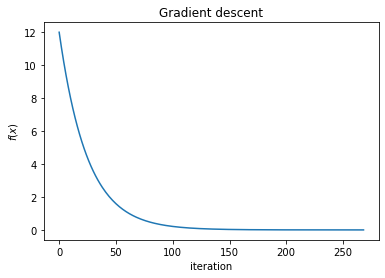

## Newton Descent
Given a twice differentiable function, Newton descent gives us an even faster way to identify the the minimum of a function. If we are able to find the Hessian of the function and its inverse, we are able to leverage a quadratic approximation (instead of a linear approximation in the gradient descent case) to iteratively minimize a function. Pictured below is Newton descent applied towards minimizing $f(x_1, x_2, x_3) = x_1^2 + x_2^2 + x_3^2$. Since $f$ is a quadratic function, it only takes one step of Newton descent to find its minimum.

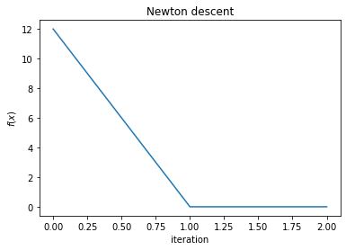

## Conjugate Descent
Given a convex quadratic function, conjugate descent helps us identify its minimum. In contrast to Newton descent, we do not need to take the inverse of the Hessian (saving compute resources). Here we minimize a function of the form $f(x) = x^T Q x - b^T x$ using conjugate descent.

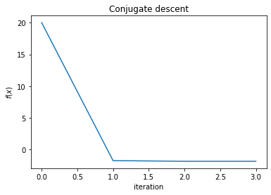

## Simulated Annealing
Simulated annealing is our first stochastic search method for minimizing a function $f(x)$. In contrast to the previous algorithms introduced, simulated annealing does not require us to compute the derivative of the function we are trying to minimize. We simply sample from a distribution around $x$ and check if it's an improvement. If so, we set $x$ to this new value. If not, may or may not set $x$ to this new value according to some probability. This is similar to the exploration-exploitation trade-off that we will see later in our reinforcement learning algorithms.

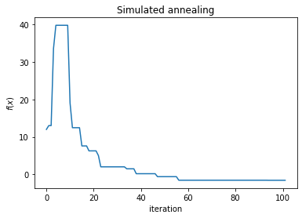

## Cross-Entropy Methods
Cross-Entropy methods are stochastic search methods for minimizing a function $f(x)$. In simulated annealing, we can think of the algorithm jumping from from one point to the next hoping to find points that bring us closer to the minimum. In contrast, cross-entropy methods collect multiple samples from a distribution around $x$ and fits a new distribution over the best of these samples. As this process is repeated, the distribution gets closer and closer to the minimum.

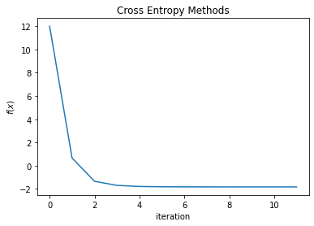

## Search Gradient
Search gradient is the first stochastic algorithm we've introduced that leverages the gradient of a function. While gradient, Newton, and conjugate descent leverage the gradient of the function being minimized, search gradient leverages the gradient of a distribution. Similar to cross-entropy methods, we draw samples from a distribution around $x$. Instead of fitting a distribution over the best samples, we use the gradient of the distribution to update the parameters of the distribution. In our implementation, we use the Gaussian distribution which means we are updating the mean and covariance matrix with each iteration.

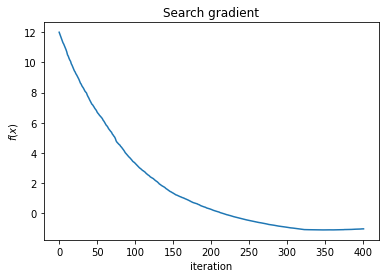

## A* search
A* search is basically Dijkstra's algorithm but augmented with a heuristic function. Our goal is to find the least cost path between some start node and goal node. In our implementation, we use manhattan distance as our heuristic function. 
The darker cells are obstacles that our agent cannot pass through. The yellow and green cells represent the goal and start nodes respectively. The goal is to move from the start node to the goal node in the fewest number of steps.

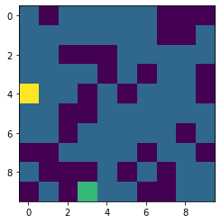
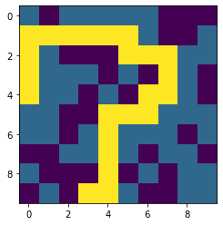

## minimax search
TODO

## (extra) RRT (rapidly-exploring random trees)
TODO

## Value iteration

## Policy iteration
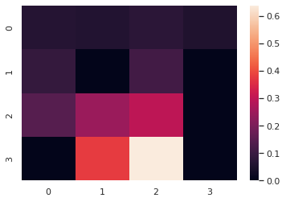

## Monte Carlo Policy Evaluation 
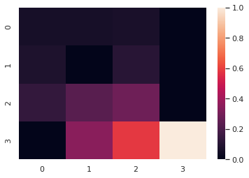

## Temporal Difference Policy Evaluation

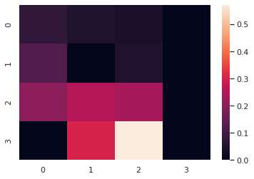

## Tabular Q learning

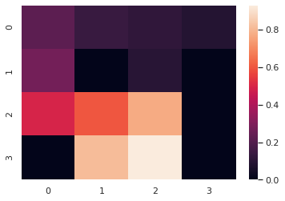

## Deep Q learning
TODO

## (extra) PPO (Proximal Policy Optimization)
TODO

## Monte Carlo Tree Search
TODO